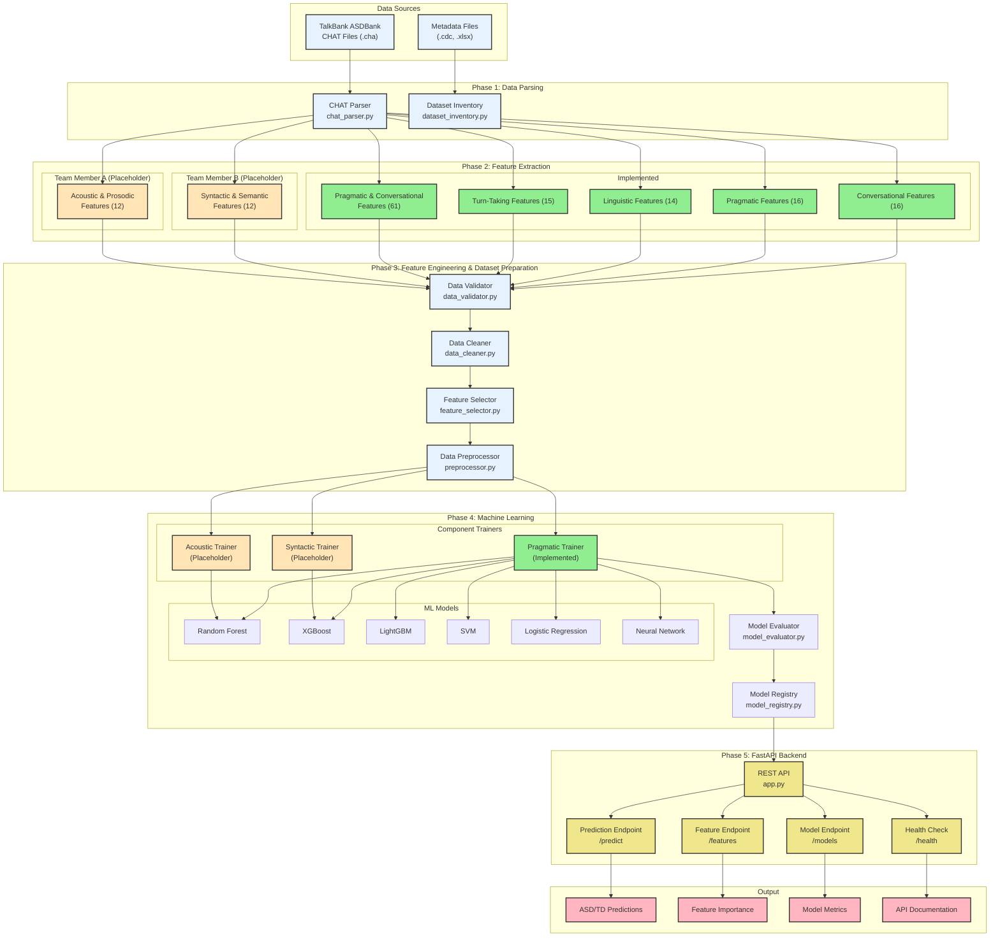

# ASD Detection System

A comprehensive machine learning system for detecting Autism Spectrum Disorder (ASD) in children using conversational patterns from TalkBank ASDBank datasets.

## Overview

This system extracts **pragmatic and conversational features** from speech transcripts and trains machine learning models to classify children as either ASD or Typically Developing (TD). The architecture supports three feature categories with separate training pipelines:

- **Acoustic & Prosodic** - Team Member A (Placeholder)
- **Syntactic & Semantic** - Team Member B (Placeholder)  
- **Pragmatic & Conversational** - Fully Implemented

## System Architecture

### Complete System Diagram



### Component Status Legend
- **Green (Implemented)**: Pragmatic & Conversational features - Production ready
- **Orange (Placeholder)**: Acoustic & Syntactic features - Ready for team implementation
- **Blue (Data)**: Parsing and preprocessing components
- **Yellow (API)**: FastAPI backend services
- **Pink (Output)**: Results and documentation

### Directory Structure

```
src/
├── parsers/                    # CHAT file parsing
├── features/                   # Feature extraction
│   ├── acoustic_prosodic/     # Team Member A (placeholder)
│   ├── syntactic_semantic/    # Team Member B (placeholder)
│   └── pragmatic_conversational/ # Fully implemented (61 features)
├── preprocessing/              # Data preprocessing pipeline
├── models/                     # ML training & evaluation
│   ├── acoustic_prosodic/     # Team Member A (placeholder)
│   ├── syntactic_semantic/    # Team Member B (placeholder)
│   └── pragmatic_conversational/ # Fully implemented
└── api/                        # FastAPI backend
```

## Quick Start

### 1. Setup
```bash
pip install -r requirements.txt
```

### 2. Extract Features
```bash
python examples/example_usage.py
```

### 3. Train Models
```bash
python examples/train_model.py
```

### 4. Start API
```bash
python run_api.py
# Visit: http://localhost:8000/docs
```

### 5. Open Frontend
```bash
# Open frontend.html in your browser
open frontend.html
# Or visit: file:///path/to/frontend.html
```

## Implemented Features

### Pragmatic & Conversational (61 Features)

**Turn-Taking (15 features)**
- Turn length statistics, overlap patterns, pause analysis

**Linguistic Complexity (14 features)**  
- MLU (Mean Length of Utterance), TTR (Type-Token Ratio), sentence complexity

**Pragmatic Markers (16 features)**
- Echolalia detection, pronoun reversal, social language use

**Conversational Management (16 features)**
- Topic shifts, conversational repairs, coherence measures

## Machine Learning Pipeline

### Models Supported
- Random Forest
- XGBoost  
- LightGBM
- Support Vector Machine
- Logistic Regression
- Neural Network (MLP)

### Preprocessing
- Data validation & cleaning
- Feature scaling & selection
- Train/test splitting with stratification

### Evaluation
- Accuracy, Precision, Recall, F1-Score
- ROC AUC, Confusion Matrix
- Feature importance analysis

## Component Development

### For Team Member A (Acoustic/Prosodic)
```python
# Implement in: src/models/acoustic_prosodic/
class AcousticProsodicTrainer:
    def train_multiple_models(self, X_train, y_train):
        # Your implementation here
        pass
```

**Focus Areas:**
- Pitch features (mean, std, range, slope)
- Spectral features (MFCC, spectral centroid)  
- Temporal features (speaking rate, pause patterns)
- Prosodic features (intonation, stress, rhythm)

**Required Libraries:** `librosa`, `praat-parselmouth`, `scikit-learn`

### For Team Member B (Syntactic/Semantic)
```python
# Implement in: src/models/syntactic_semantic/
class SyntacticSemanticTrainer:
    def train_multiple_models(self, X_train, y_train):
        # Your implementation here
        pass
```

**Focus Areas:**
- Syntactic features (dependency depth, clause complexity)
- Semantic features (coherence, density, consistency)
- Grammatical features (error rates, agreement)
- Complexity features (structure diversity, abstractness)

**Required Libraries:** `spacy`, `nltk`, `scikit-learn`

### Current Implementation (Pragmatic/Conversational)
```python
# Already implemented in: src/models/pragmatic_conversational/
from src.models.pragmatic_conversational import PragmaticConversationalTrainer

trainer = PragmaticConversationalTrainer()
models = trainer.train_multiple_models(X_train, y_train, X_test, y_test)
```

## API Endpoints

### Core Endpoints
- `POST /predict` - Make predictions on new data
- `GET /features` - List all supported features
- `GET /categories` - Show implementation status by category
- `GET /models` - List available trained models
- `GET /health` - Health check

### Example Usage
```python
import requests

# Make prediction
response = requests.post("http://localhost:8000/predict", 
                        json={"participant_id": "ASD_001", "transcript": "hello there"})
prediction = response.json()

# Check feature status
response = requests.get("http://localhost:8000/categories")
status = response.json()
```

## Web Frontend

A simple HTML frontend (`frontend.html`) is provided for easy interaction with the API:

### Features
- **Prediction Interface**: Enter participant ID and transcript for ASD/TD prediction
- **Feature Browser**: View all 61 available pragmatic/conversational features
- **Category Status**: Check implementation status of all three feature categories
- **Model Management**: View available trained models
- **API Testing**: Test connection and explore endpoints

### Usage
1. Start the API server: `python run_api.py`
2. Open `frontend.html` in your browser
3. The frontend will automatically test the connection
4. Use the interface to make predictions and explore the system

### Interface Sections
- **API Configuration**: Set API URL and test connection
- **Make Prediction**: Submit transcripts for ASD/TD classification
- **Available Features**: Browse all extracted features
- **Feature Categories**: View implementation status by team
- **Available Models**: See trained model information

## Data Format

### Input Data
```python
# CHAT format files (.cha) from TalkBank ASDBank
data = {
    'participant_id': 'ASD_001',
    'transcript': '*CHI: hello there .',
    'diagnosis': 'ASD'  # or 'TD'
}
```

### Feature Output
```python
# 61 pragmatic/conversational features
features = {
    'mlu_words': 4.2,
    'type_token_ratio': 0.65,
    'echolalia_ratio': 0.1,
    'turn_taking_patterns': 0.3,
    # ... 57 more features
}
```

## Testing

### Run Feature Extraction
```bash
python examples/example_usage.py
```

### Run Model Training
```bash
python examples/train_model.py
```

### Test API
```bash
python run_api.py
# Visit http://localhost:8000/docs for interactive testing
```

## Performance

### Current Implementation (Pragmatic/Conversational)
- **Features:** 61 pragmatic/conversational features
- **Models:** 7 ML algorithms with hyperparameter tuning
- **Evaluation:** Comprehensive metrics and feature importance
- **Status:** Production-ready

### Placeholder Components
- **Acoustic/Prosodic:** Ready for Team Member A implementation
- **Syntactic/Semantic:** Ready for Team Member B implementation

## Integration Workflow

1. **Team Member A** implements acoustic/prosodic trainer
2. **Team Member B** implements syntactic/semantic trainer  
3. **Main orchestrator** automatically integrates all components
4. **API** serves predictions from all feature categories

```python
# Main orchestrator handles all components
from src.models.model_trainer import ModelTrainer

trainer = ModelTrainer()  # Has all component trainers
results = trainer.train_by_category(feature_data, y_train)

# Results show status for each component:
# - acoustic_prosodic: "placeholder" or "implemented"
# - syntactic_semantic: "placeholder" or "implemented"  
# - pragmatic_conversational: "implemented"
```

## Requirements

### Core Dependencies
- `pandas` - Data manipulation
- `scikit-learn` - Machine learning
- `xgboost` - Gradient boosting
- `lightgbm` - Light gradient boosting
- `fastapi` - API framework
- `uvicorn` - ASGI server

### Feature-Specific Dependencies
- `pylangacq` - CHAT file parsing
- `loguru` - Enhanced logging
- `joblib` - Model serialization


---


[//]: # (```mermaid)

[//]: # (flowchart TB)

[//]: # (  %% Data Sources)

[//]: # (  subgraph DS["Data Sources"])

[//]: # (    A1["TalkBank ASDBank\nCHAT files &#40;.cha&#41;"])

[//]: # (    A2["Metadata &#40;.cdc, .xlsx&#41;"])

[//]: # (    A3["Audio files &#40;.wav&#41; [future]"])

[//]: # (  end)

[//]: # ()
[//]: # (  %% Phase 1: Parsing)

[//]: # (  subgraph P1["Phase 1: Data Parsing"])

[//]: # (    B1["CHAT Parser\nsrc/parsers/chat_parser.py"])

[//]: # (    B2["Dataset Inventory\nsrc/parsers/dataset_inventory.py"])

[//]: # (    N1["Output: TranscriptData &#40;utterances, diagnosis, age, counts&#41;"])

[//]: # (  end)

[//]: # ()
[//]: # (  %% Phase 2: Feature Extraction)

[//]: # (  subgraph P2["Phase 2: Feature Extraction"])

[//]: # (    direction TB)

[//]: # (    C0["Feature Orchestrator\nsrc/features/feature_extractor.py"])

[//]: # ()
[//]: # (    subgraph P2A["Pragmatic & Conversational &#40;Implemented&#41;"])

[//]: # (      C1["Turn-Taking\nturn_taking.py"])

[//]: # (      C2["Linguistic\nlinguistic.py"])

[//]: # (      C3["Pragmatic\npragmatic.py"])

[//]: # (      C4["Conversational\nconversational.py"])

[//]: # (    end)

[//]: # ()
[//]: # (    subgraph P2B["Syntactic & Semantic &#40;Placeholder&#41;"])

[//]: # (      C5["SyntacticSemanticFeatures\nsyntactic_semantic/"])

[//]: # (    end)

[//]: # ()
[//]: # (    subgraph P2C["Acoustic & Prosodic &#40;Temporarily disabled&#41;"])

[//]: # (      C6["AcousticProsodicFeatures\nacoustic_prosodic/"])

[//]: # (    end)

[//]: # ()
[//]: # (    N2["Output: FeatureSet &#40;dict&#41; and DataFrame rows"])

[//]: # (  end)

[//]: # ()
[//]: # (  %% Phase 3: Preprocessing)

[//]: # (  subgraph P3["Phase 3: Data Preprocessing"])

[//]: # (    D1["Validation\ndata_validator.py"])

[//]: # (    D2["Cleaning &#40;missing/outliers&#41;\ndata_cleaner.py"])

[//]: # (    D3["Feature Selection\nfeature_selector.py"])

[//]: # (    D4["Scaling &#40;Standard/MinMax/Robust&#41;\npreprocessor.py"])

[//]: # (    N3["fit_transform → X_train, X_test, y_train, y_test"])

[//]: # (  end)

[//]: # ()
[//]: # (  %% Phase 4: Modeling)

[//]: # (  subgraph P4["Phase 4: Modeling"])

[//]: # (    E1["Category Trainers\nsrc/models/.../model_trainer.py"])

[//]: # (    E2["Model Evaluator\nmodel_evaluator.py"])

[//]: # (    E3["Model Registry\nmodel_registry.py"])

[//]: # ()
[//]: # (    subgraph E4["Algorithms"])

[//]: # (      F1["Random Forest"])

[//]: # (      F2["XGBoost"])

[//]: # (      F3["LightGBM"])

[//]: # (      F4["SVM"])

[//]: # (      F5["Logistic Regression"])

[//]: # (      F6["Neural Network &#40;MLP&#41;"])

[//]: # (    end)

[//]: # (  end)

[//]: # ()
[//]: # (  %% Phase 5: Serving &#40;API&#41;)

[//]: # (  subgraph P5["Phase 5: FastAPI Serving"])

[//]: # (    G1["FastAPI App\nsrc/api/app.py"])

[//]: # (    G2["/predict &#40;features&#41;"])

[//]: # (    G3["/predict/file &#40;CSV&#41;"])

[//]: # (    G4["/predict/transcript &#40;.cha&#41;"])

[//]: # (    G5["/features, /categories, /models, /health"])

[//]: # (    N4["transcript → parse → extract → preprocess → predict"])

[//]: # (  end)

[//]: # ()
[//]: # (  %% Outputs)

[//]: # (  subgraph OUT["Outputs"])

[//]: # (    H1["Feature CSVs\noutput/*.csv"])

[//]: # (    H2["Trained models + preprocessors\nmodels/ &#40;via registry&#41;"])

[//]: # (    H3["Predictions &#40;ASD/TD&#41; + probabilities"])

[//]: # (    H4["Metrics & feature importance"])

[//]: # (    H5["API Docs &#40;OpenAPI&#41;"])

[//]: # (  end)

[//]: # ()
[//]: # (  %% Edges)

[//]: # (  A1 --> B1)

[//]: # (  A2 --> B2)

[//]: # (  B1 --> C0)

[//]: # (  C0 --> C1)

[//]: # (  C0 --> C2)

[//]: # (  C0 --> C3)

[//]: # (  C0 --> C4)

[//]: # (  C0 -. optional_placeholders .-> C5)

[//]: # (  C0 -. temporarily_disabled .-> C6)

[//]: # (  C1 --> N2)

[//]: # (  C2 --> N2)

[//]: # (  C3 --> N2)

[//]: # (  C4 --> N2)

[//]: # (  N2 --> D1)

[//]: # (  D1 --> D2)

[//]: # (  D2 --> D3)

[//]: # (  D3 --> D4)

[//]: # (  D4 --> N3)

[//]: # (  D4 --> E1)

[//]: # (  E1 --> E4)

[//]: # (  E4 --> E2)

[//]: # (  E2 --> E3)

[//]: # (  C0 --> H1)

[//]: # (  E3 --> G1)

[//]: # (  G1 --> G2)

[//]: # (  G1 --> G3)

[//]: # (  G1 --> G4)

[//]: # (  G1 --> G5)

[//]: # (  G2 --> H3)

[//]: # (  G3 --> H3)

[//]: # (  G4 --> H3)

[//]: # (  E2 --> H4)

[//]: # (  G5 --> H5)

[//]: # (  E3 --> H2)

[//]: # (  ```)
API transcript sequence
  ```mermaid
  sequenceDiagram
  autonumber
  participant Client
  participant API as FastAPI (app.py)
  participant Parser as CHATParser
  participant FX as FeatureExtractor
  participant Prep as DataPreprocessor
  participant Model as Trained Model

  Client->>API: POST /predict/transcript (.cha)
  API->>Parser: parse_file(tmp_path)
  Parser-->>API: TranscriptData
  API->>FX: extract_from_transcript(TranscriptData)
  FX-->>API: FeatureSet → DataFrame row
  API->>Prep: transform(features_df)
  Prep-->>API: features_scaled_df
  API->>Model: predict + predict_proba
  Model-->>API: class, probabilities
  API-->>Client: prediction, confidence, probabilities, model_used
  ```
