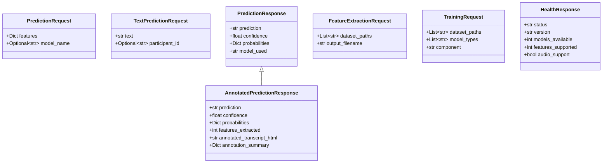

# ASD Detection System - Detailed Architecture

## Table of Contents
1. [Overall System Architecture](#1-overall-system-architecture)
2. [Input Processing Flow](#2-input-processing-flow)
3. [Feature Extraction Pipeline](#3-feature-extraction-pipeline)
4. [Model Training Flow](#4-model-training-flow)
5. [Prediction Flow](#5-prediction-flow)
6. [API Architecture](#6-api-architecture)
7. [Component Details](#7-component-details)
8. [Data Flow](#8-data-flow)

---

## 1. Overall System Architecture

---

## 2. Input Processing Flow

---

## 3. Feature Extraction Pipeline

---

## 4. Model Training Flow

---

## 5. Prediction Flow

---

## 6. API Architecture

### API Request/Response Models

---

## 7. Component Details

### Pragmatic and Conversational Component (Implemented)

### Acoustic and Prosodic Component (Placeholder)

### Syntactic and Semantic Component (Placeholder)

---

## 8. Data Flow

### Training Data Flow

### Prediction Data Flow

---

## 9. Annotation System Flow

---

## 10. Model Fusion Architecture

---

## 11. File System Structure

---

## 12. Key Data Structures

---

## Summary

This architecture implements a **modular, multimodal ASD detection system** with:

1. **Flexible Input Handling**: Supports audio (WAV, MP3), text, and CHAT files
2. **Independent Components**: Three feature extraction components that can work independently
3. **Feature Extraction**: 207+ features from pragmatic/conversational analysis (implemented), with provisions for acoustic and syntactic components
4. **Model Fusion**: Combines predictions from multiple component models
5. **Visual Annotations**: Generates intuitive HTML representations showing where features were extracted
6. **Dual-Mode Interface**: User mode for predictions, Training mode for model development
7. **REST API**: Comprehensive FastAPI backend with endpoints for all operations
8. **Extensibility**: Clear structure for team members to implement their components

### Color Legend
- **Green**: Implemented components (Pragmatic and Conversational)
- **Pink**: Placeholder components (Acoustic and Syntactic - to be implemented by team members)
- **Blue**: Audio-related components
- **Yellow**: Storage and data components

### Key Features
- **207 Features** from Pragmatic component across 6 modules
- **Multimodal Processing** for both audio and text inputs
- **Model Registry** for managing trained models
- **Annotated Transcripts** with visual markers (TURN, PAUSE, LATENCY, REPAIR, TOPIC, MARKER)
- **Dual Frontend Modes** for end users and model trainers
- **Component Independence** allowing parallel development by multiple team members
